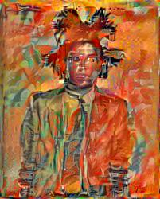
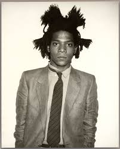
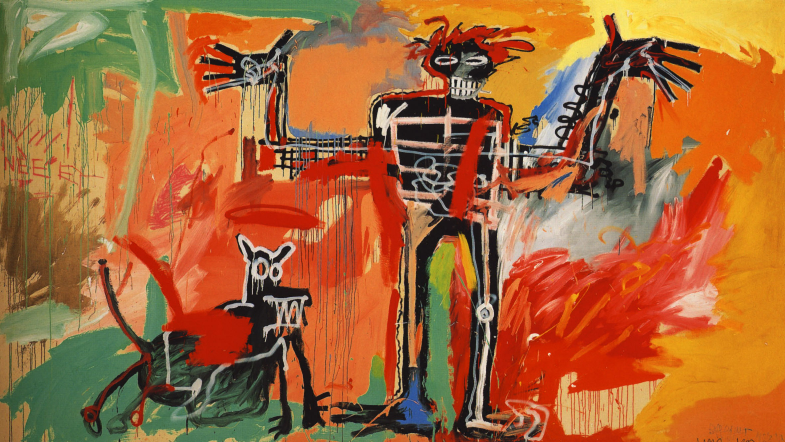

# Artists Portraits in Their Own Style
There are pictures of artists in the style of their own art. I did this using convolutional neural networks as described [here](http://arxiv.org/pdf/1508.06576v2.pdf) using Anish Athalye's [implementation](https://github.com/anishathalye/neural-style).

### Jean Michael Basquiat in the Style of Boy and Dog

This was the original picture:  

In the style of Boy and Dog:

